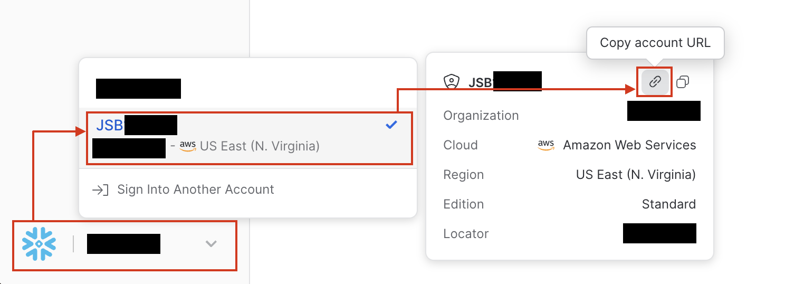

# ConnectReport Supported Web Connectors
This repo houses the Web Connector services for ConnectReport's supported Web Connectors. 

# Install
Open Powershell and execute the following:
```
cd Documents
mkdir "ConnectReport Web Connectors"
cd "./ConnectReport Web Connectors"
$scriptUrl = "https://raw.githubusercontent.com/connectreport/supported-webconnectors/main/install.ps1"
$outputFile = "install.ps1"

# Download the script
Invoke-WebRequest -Uri $scriptUrl -OutFile $outputFile

# Run the downloaded script as administrator
Start-Process powershell -ArgumentList "-ExecutionPolicy Bypass -File `"$outputFile`"" -Verb RunAs
```

## Update
Open PowerShell and execute the following:
```
cd Documents
cd "./ConnectReport Web Connectors"
$scriptUrl = "https://raw.githubusercontent.com/connectreport/supported-webconnectors/main/update.ps1"
$outputFile = "update.ps1"

# Download the script
Invoke-WebRequest -Uri $scriptUrl -OutFile $outputFile

# Run the downloaded script as administrator
Start-Process powershell -ArgumentList "-ExecutionPolicy Bypass -File `"$outputFile`"" -Verb RunAs
```

## Logs 
Logs are persisted to `C:\ProgramData\ConnectReport\log\native-webconnectors` and rotated daily. You can use these logs to identify any issues configuring connectors. 

You can adjust the log level in `settings.json`, using the top level key `logLevel`. Valid values are `"debug"`, `"info"`, and `"error"`. 

## Locale
You can configure the locale for currency and date formatting from `settings.json` using the top level key `locale`. 

Supported locales are `en-us` and `en-gb`. 


## Aggregations 
You can add aggregation to a connector as follows
```
{
  "connectors": [
    {
      "name": "BigQuery",
      "type": "bigquery",
      "aggregations": [{
        // Table from data source to attach aggregation to
        "sourceTable": "products",
        // "dimension" || "measure" 
        "fieldType": "measure",
        // Identifier for the aggregation 
        "fieldIdentifier": "products.margin",
        // SQL that will be sent to the data source when the identifier is used
        "sql": "products.retail_price - products.cost"
      }]
    }
  ]
}
```

## Google BigQuery Integration 
The BigQuery integration supports [Google's Application Default Credentials](https://cloud.google.com/docs/authentication/application-default-credentials) (ADC) authentication strategy. 

Setup steps:
-	Run the first two commands [here](https://codelabs.developers.google.com/codelabs/cloud-bigquery-nodejs#3) to create a BigQuery service account in Google Cloud. These commands may be executed from the Google Cloud Shell Terminal 
- Running outside of GCP? You will need to run the third command [here](https://codelabs.developers.google.com/codelabs/cloud-bigquery-nodejs#3) to create a key file that ADC will recognize
- Running in GCP? Associate the service account with the ConnectReport virtual machine in Google Cloud 
  -	Edit the virtual machine 
  - Under Identity and API access > Service Account, choose the service account created in the previous step
- Within C:\Documents\ConnectReport Web Connectors\repo, create a new file named `settings.json`. Update contents as follows:
```
{
  "connectors": [
    {
      "name": "BigQuery",
      "type": "bigquery",
      "config": {
        "DATABASE": "bigquery-public-data.thelook_ecommerce",
        "LOCATION": "US"
      },
      "env": {
        "GOOGLE_CLOUD_PROJECT": "bigquery-connectreport",
        "GOOGLE_APPLICATION_CREDENTIALS": "key.json"
      }
    }
  ]
}
```
- Within the new settings.json file:
  - Update `env.GOOGLE_CLOUD_PROJECT `to the name of your GCP Project
  - If running inside GCP, Remove `env.GOOGLE_APPLICATION_CREDENTIALS`. If running outside of GCP, you will need to point `env.GOOGLE_APPLICATION_CREDENTIALS` to the path to the keyfile created in step 3 above
  - Update `config.DATABASE` to the name of your database 
- Restart ConnectReport Web Connector Service Manager service


## Snowflake Integration 
The Snowflake integration supports password based authentication. 

> _Future support for Key Pair Authentication may allow the integration to access Snowflake on behalf of users and enforce role-based access controls using Snowflake permissions._

In your settings.json file, configure the integration as indicated below, replacing `ACCOUNT`, `DATABASE`, `SCHEMA`, `USERNAME`, and `PASSWORD` with the appropriate values. 

```
{
  "connectors": [
    {
      "name": "Snowflake",
      "type": "snowflake",
      "config": {
        "ACCOUNT": "example.us-east-1",
        "DATABASE": "SNOWFLAKE_SAMPLE_DATA",
        "SCHEMA": "TPCH_SF1",
        "USERNAME": "EXAMPLE",
        "PASSWORD": "password"
      }
    }
  ]
}
```

To gather the `ACCOUNT` value:
- Navigate to Snowsight
- Open the account selector and review the list of accounts that you have previously signed in to.
- Locate the account for which you want to connect.
- Hover over the account to view additional details and select the link icon to copy the account URL to your clipboard.



- Your clipboard will contain a value like `https://example.us-east-1.snowflakecomputing.com`. 

  Copy the value between `https://` and `.snowflakecomputing.com` 

  In this example, the `ACCOUNT` value is `example.us-east-1`

Once your settings.json file is updated, restart the ConnectReport Web Connector Service Manager service
